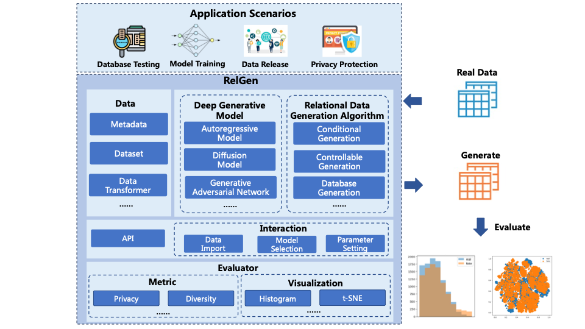

<p align="center">
  
</p>

# RelGen

[](https://github.com/ruc-datalab/RelGen/actions/workflows/unit.yml)
[](https://github.com/ruc-datalab/RelGen/actions/workflows/e2e.yml)
[](https://github.com/ruc-datalab/RelGen/blob/main/tutorial/census_synthesis.ipynb)
[](https://pypi.org/project/relgen/)
[](./LICENSE)

**RelGen** is the abbreviation of **Rel**ation **Gen**eration. This tool is used to generate relational data in databases. RelGen is a powerful tool designed to generate relational data for use in databases. Interestingly, the pronunciation of "Rel" is quite similar to "Real," which subtly highlights the fact that the relational data produced by RelGen is remarkably authentic and reliable. 


## Overview

RelGen is a Python library designed to generate real relational data for users. 
RelGen uses a variety of advanced deep generative models and algorithms to learn data distribution from real data and generate high-quality simulation data.RelGen can be applied to database system testing, data publishing and cross-domain data flow, as well as machine learning data augmentation.

<p align="center">
  
  <br>
  <b>Figure 1: RelGen Overall Architecture</b>
</p>

## Features
* ✨ **Supports multiple fields and scenarios.** RelGen is suitable for a variety of scenarios, including private data release, data augmentation, database testing and so on.

* ✨ **Advanced relational data generation models and algorithms.** RelGen provides users with a variety of deep generative models to choose from, and uses effective relational data generation algorithms to generate high-quality relational data.

* ✨ **Comprehensive quality evaluation for generated relational data.** RelGen comprehensively evaluates the quality of generated relational data from multiple dimensions, and visualizes the difference between real relational data and generated relational data.

## Architecture of this project
| Important Link | Notes |
| --- | --- |
| 📑[Tutorial](tutorial) | Contains several examples of generating database using RelGen |
| 📦[Package](relgen) | Contains the code implementation of the RelGen project |
| 📖[Docs](docs) | The documentation of this project |

## Installation
RelGen requires Python version 3.7 or later. You can choose one of the following methods to install the relgen.

### Install from pip

```bash
pip install relgen
```

### Install from source
```bash
git clone https://github.com/ruc-datalab/RelGen.git && cd RelGen
pip install -r requirements.txt
```

## Quick-Start
In this section, you will learn how to use RelGen package with a simple example. You will load a dataset with RelGen, construct a model for data synthesis, train the model and generate data sample from it.

### Loading Dataset
Load a demo dataset to get started. This dataset is a single table describing the census. You can find this data in [census](datasets/census/).

Load metadata for the census dataset. Metadata usually contains descriptive information about the dataset, such as field names, types, associations, etc., and is used to help better understand and process the data.
```python
from relgen.data.metadata import Metadata

metadata = Metadata()
metadata.load_from_json("datasets/census/metadata.json")
```

Load data for the census dataset.
```python
import pandas as pd

data = {
    "census": pd.read_csv("datasets/census/census.csv")
}
```

<p align="center">
  
</p>

> **Some introduciton for census datasets**
> 
> This data was extracted from the 1994 Census bureau database by Ronny Kohavi and Barry Becker (Data Mining and Visualization, Silicon Graphics). A set of reasonably clean records was extracted using the following conditions: ((AAGE>16) && (AGI>100) && (AFNLWGT>1) && (HRSWK>0)). The prediction task is to determine whether a person makes over $50K a year.

Load metadata and combine it with actual data created and processed the dataset in preparation for the rest of the process.
```python
from relgen.data.dataset import Dataset

dataset = Dataset(metadata)
dataset.fit(data)
```

### Generating Data

Create the MADESynthesizer instance, train the synthesizer using the fit method, and learn data structures to generate similar relational data.
```python
from relgen.synthesizer.arsynthesizer import MADESynthesizer

synthesizer = MADESynthesizer(dataset)
synthesizer.fit(data)
```

The synthesizer is now capable of generating relational data.
```python
sampled_data = synthesizer.sample()
```

<p align="center">
  
</p>

### Evaluating Data

The RelGen library allows you to evaluate the relational data by comparing it to the real data. Let's start by creating an evaluator.
```python
from relgen.evaluator import Evaluator

evaluator = Evaluator(data["census"], sampled_data["census"])
```

Show comparison histogram of data distribution between real data and generated data. Users can visualise whether the distributions on these key features are consistent, and thus assess the performance of the generated model and the quality of the generated data.
```python
evaluator.eval_histogram(columns=["age", "sex", "relationship"])
```

<p align="center">
  
</p>

Show comparison t-SNE plot of data distribution between real data and generated data.The t-SNE plot helps the user to observe the overall structural similarity between the generated data and the real data, and to evaluate the effectiveness of the generated model.
```python
evaluator.eval_tsne()
```

<p align="center">
  
</p>

The code of Quick Start can be found in [Quick Start](QuickStart.ipynb).

## More
You can try more examples in [tutorial](tutorial). If you have any question, please [contanct us](https://github.com/ruc-datalab/RelGen/issues). 

## Cite
If you find RelGen useful for your research or development, please cite the following paper: [Tabular data synthesis with generative adversarial networks: design space and optimizations](https://link.springer.com/article/10.1007/s00778-023-00807-y).

```bibtex
@article{liu2024tabular,
  title={Tabular data synthesis with generative adversarial networks: design space and optimizations},
  author={Liu, Tongyu and Fan, Ju and Li, Guoliang and Tang, Nan and Du, Xiaoyong},
  journal={The VLDB Journal},
  volume={33},
  number={2},
  pages={255--280},
  year={2024},
  publisher={Springer}
}
```
