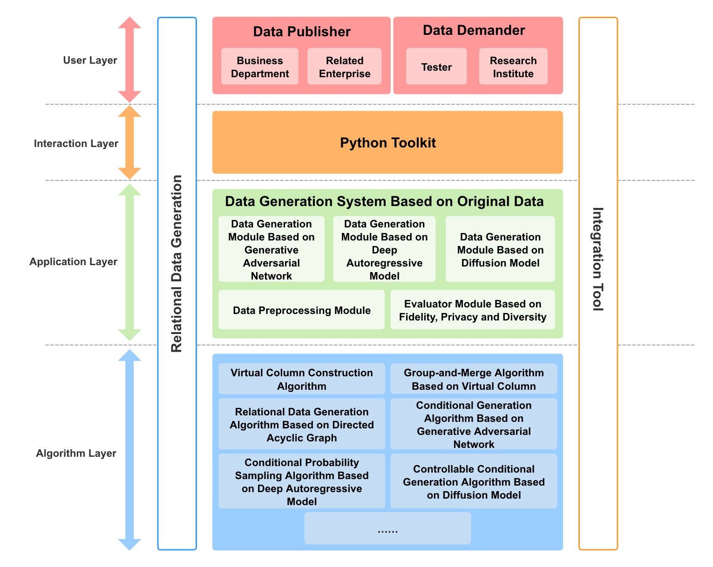
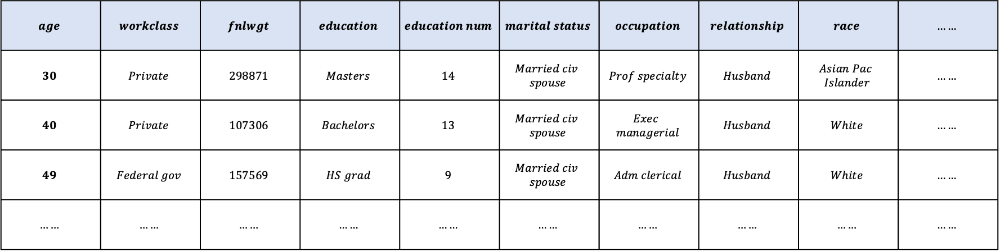
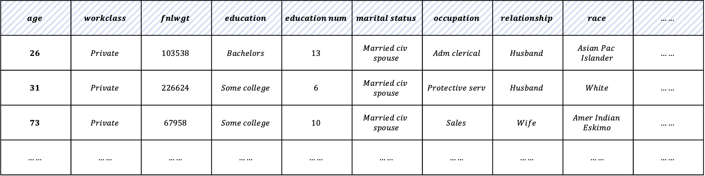
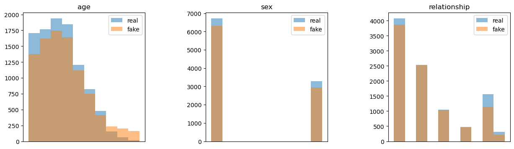
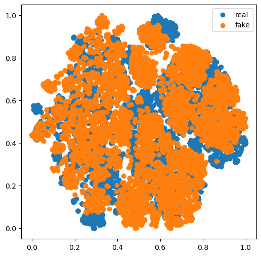

<p align="center">
  
</p>

# RelGen

[](https://github.com/ruc-datalab/RelGen/actions/workflows/unit.yml)
[](https://github.com/ruc-datalab/RelGen/actions/workflows/e2e.yml)
[](https://github.com/ruc-datalab/RelGen/blob/main/tutorial/census_synthesis.ipynb)
[](./LICENSE)

**RelGen** is the abbreviation of **Rel**ation **Gen**eration. This tool is used to generate relational data in databases. 
On the other hand, the pronunciation of **Rel** is similar to **Real**, which means that the relational data generated by RelGen is very real.

## Overview

RelGen is a Python library designed to generate real relational data for users. 
RelGen uses a variety of advanced deep generative models and algorithms to learn data distribution from real data and generate high-quality simulation data.

<p align="center">
  
  <br>
  <b>Figure</b>: RelGen Overall Architecture
</p>

## Features
**Generate relational data using deep generative models.** RelGen provides a variety of deep generative models, 
including Generative Adversarial Network (GAN), Autoregressive Model (AR Model) and Diffusion Model.

**Generate data for multiple relational tables.** RelGen can flexibly generate data for multiple relational tables in the database, 
so that the data distribution of each generated table is close to that of the original table, and the joined table can also be similar to the original joined table.

**Evaluate the quality of generated relational data.** RelGen evaluates the generated relational data in terms of fidelity, privacy, and diversity, 
and visualizes the quality of the generated relational data using histogram and t-SNE plot.

## Installation
RelGen requires Python version 3.7 or later.

RelGen requires torch version 1.7.0 or later. If you want to use RelGen with GPU,
please ensure that CUDA or cudatoolkit version is 9.2 or later.
This requires NVIDIA driver version >= 396.26 (for Linux) or >= 397.44 (for Windows10).

### Install from conda

### Install from source
```bash
git clone https://github.com/ruc-datalab/RelGen.git && cd RelGen
pip install -r requirements.txt
```

## Quick-Start

### Load Dataset
Load a demo dataset to get started. This dataset is a single table describing the census.

Load metadata for the census dataset.
```python
from relgen.data.metadata import Metadata

metadata = Metadata()
metadata.load_from_json("datasets/census/metadata.json")
```

Load data for the census dataset.
```python
import pandas as pd

data = {
    "census": pd.read_csv("datasets/census/census.csv")
}
```

<p align="center">
  
</p>

Encapsulate the census dataset and process it.
```python
from relgen.data.dataset import Dataset

dataset = Dataset(metadata)
dataset.fit(data)
```

### Generating Data

Train the synthesizer.
```python
from relgen.synthesizer.arsynthesizer import MADESynthesizer

synthesizer = MADESynthesizer(dataset)
synthesizer.fit(data)
```

Generate relational data.
```python
sampled_data = synthesizer.sample()
```

<p align="center">
  
</p>

### Evaluating Data

Compare real data and generated data to evaluate the quality of generated data.
```python
from relgen.evaluator import Evaluator

evaluator = Evaluator(data["census"], sampled_data["census"])
```

Show comparison histogram of data distribution between real data and generated data.
```python
evaluator.eval_histogram(columns=["age", "sex", "relationship"])
```

<p align="center">
  
</p>

Show comparison t-SNE plot of data distribution between real data and generated data.
```python
evaluator.eval_tsne()
```

<p align="center">
  
</p>
