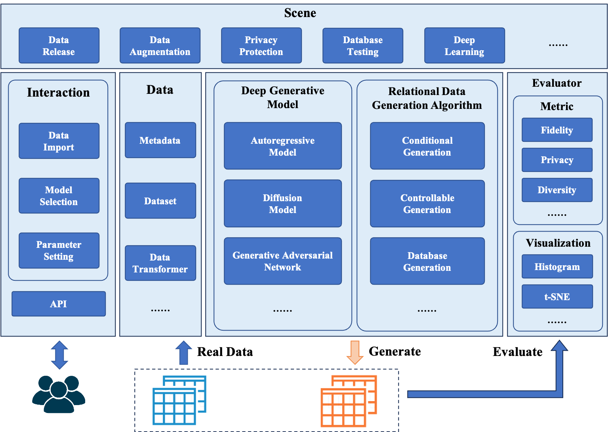

<p align="center">
  
</p>
<font color='red'>换一个好看的logo </font>

# RelGen

[](https://github.com/ruc-datalab/RelGen/actions/workflows/unit.yml)
[](https://github.com/ruc-datalab/RelGen/actions/workflows/e2e.yml)
[](https://github.com/ruc-datalab/RelGen/blob/main/tutorial/census_synthesis.ipynb)
[](https://pypi.org/project/relgen/)
[](./LICENSE)

**RelGen** is the abbreviation of **Rel**ation **Gen**eration. This tool is used to generate relational data in databases. 
On the other hand, the pronunciation of **Rel** is similar to **Real**, which means that the relational data generated by RelGen is very real.

## Overview

RelGen is a Python library designed to generate real relational data for users. 
RelGen uses a variety of advanced deep generative models and algorithms to learn data distribution from real data and generate high-quality simulation data.RelGen can be applied to database system testing, data publishing and cross-domain data flow, as well as machine learning data augmentation.


<font color='red'>图画得更好看一些</font>

<p align="center">
  
  <br>
  <b>Figure</b>: RelGen Overall Architecture
</p>

## Features
* ✨ **Supports multiple fields and scenarios.** RelGen is suitable for a variety of scenarios, including private data release, data augmentation, database testing and so on.

* ✨ **Advanced relational data generation models and algorithms.** RelGen provides users with a variety of deep generative models to choose from, and uses effective relational data generation algorithms to generate high-quality relational data.

* ✨ **Comprehensive quality evaluation for generated relational data.** RelGen comprehensively evaluates the quality of generated relational data from multiple dimensions, 
and visualizes the difference between real relational data and generated relational data.

## Installation
RelGen requires Python version 3.7 or later.

### Install from pip

```bash
pip install relgen
```

### Install from source
```bash
git clone https://github.com/ruc-datalab/RelGen.git && cd RelGen
pip install -r requirements.txt
```

## Quick-Start

### Loading Dataset
Load a demo dataset to get started. This dataset is a single table describing the census.

Load metadata for the census dataset.
```python
from relgen.data.metadata import Metadata

metadata = Metadata()
metadata.load_from_json("datasets/census/metadata.json")
```

Load data for the census dataset.
```python
import pandas as pd

data = {
    "census": pd.read_csv("datasets/census/census.csv")
}
```

<p align="center">
  
</p>

Encapsulate the census dataset and process it.
```python
from relgen.data.dataset import Dataset

dataset = Dataset(metadata)
dataset.fit(data)
```

### Generating Data

Create MADESynthesizer instances, train the synthesizer using the fit method, and learn data structures to generate similar relational data.
```python
from relgen.synthesizer.arsynthesizer import MADESynthesizer

synthesizer = MADESynthesizer(dataset)
synthesizer.fit(data)
```

The synthesizer is now capable of generating relational data.
```python
sampled_data = synthesizer.sample()
```

<p align="center">
  
</p>

### Evaluating Data

The RelGen library allows you to evaluate the relational data by comparing it to the real data. Let's start by creating an evaluator.
```python
from relgen.evaluator import Evaluator

evaluator = Evaluator(data["census"], sampled_data["census"])
```

Show comparison histogram of data distribution between real data and generated data.
```python
evaluator.eval_histogram(columns=["age", "sex", "relationship"])
```

<p align="center">
  
</p>

Show comparison t-SNE plot of data distribution between real data and generated data.
```python
evaluator.eval_tsne()
```

<p align="center">
  
</p>

## Cite
If you find RelGen useful for your research or development, please cite the following paper: [Tabular data synthesis with generative adversarial networks: design space and optimizations](https://link.springer.com/article/10.1007/s00778-023-00807-y).

```bibtex
@article{liu2024tabular,
  title={Tabular data synthesis with generative adversarial networks: design space and optimizations},
  author={Liu, Tongyu and Fan, Ju and Li, Guoliang and Tang, Nan and Du, Xiaoyong},
  journal={The VLDB Journal},
  volume={33},
  number={2},
  pages={255--280},
  year={2024},
  publisher={Springer}
}
```
